# Тестування працездатності системи

## POST - User

#### Запит

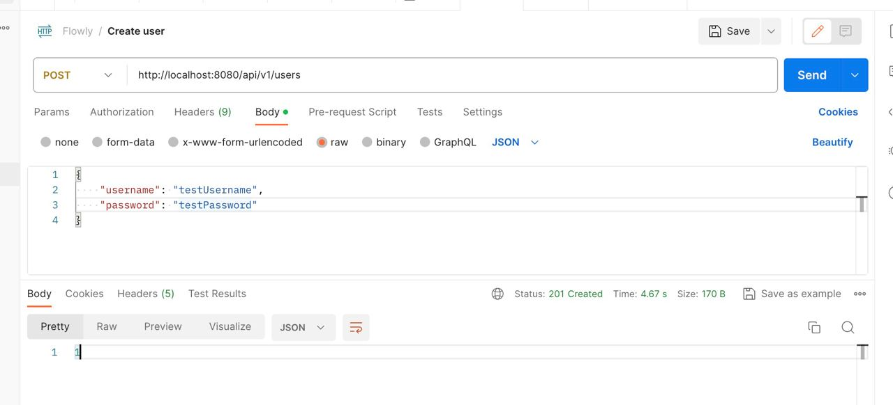

#### Результат

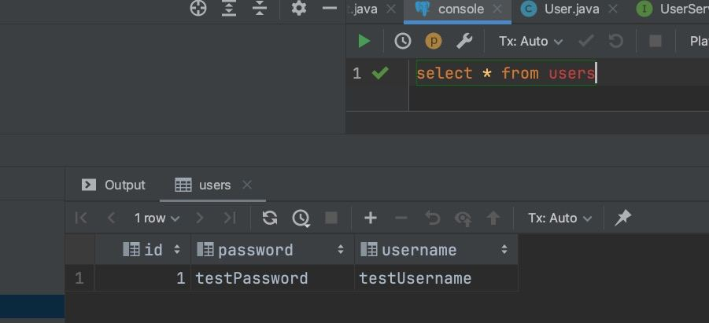

## PUT - User

#### Запит

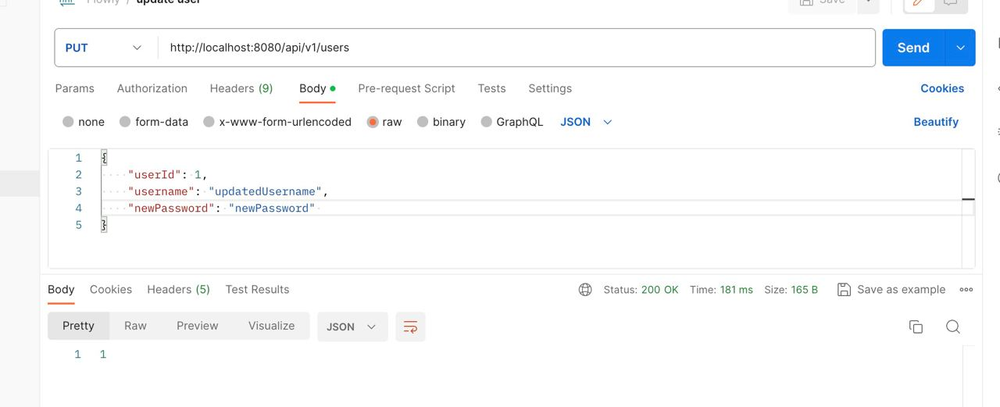

#### Результат

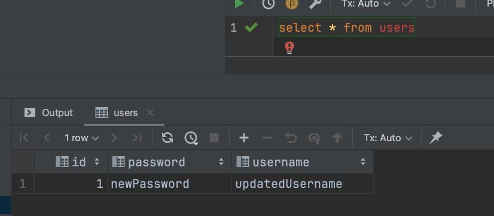

## DELETE - User

#### Запит

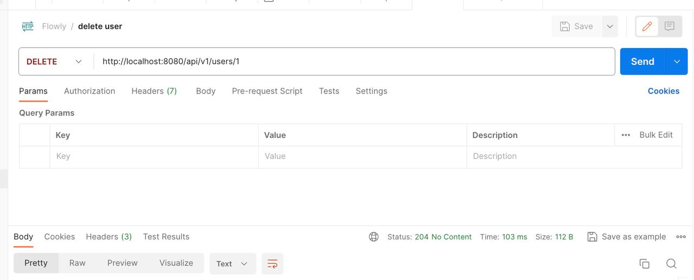

#### Результат

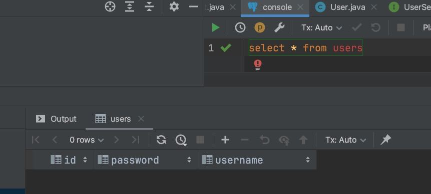

## POST - Task

#### Запит

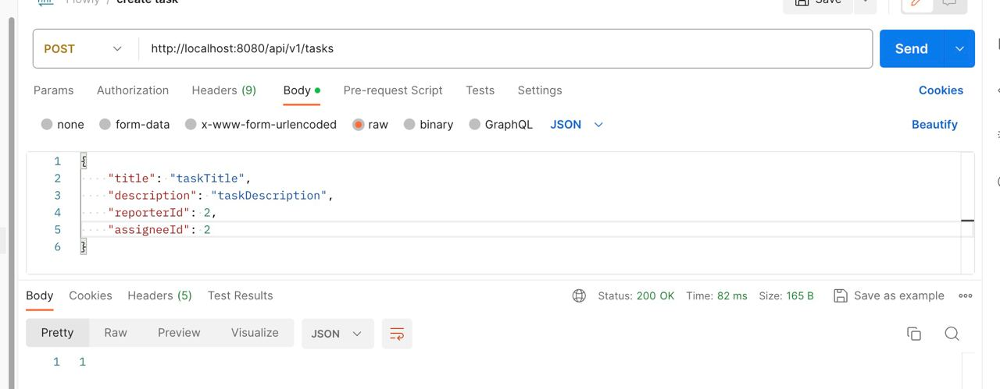

#### Результат

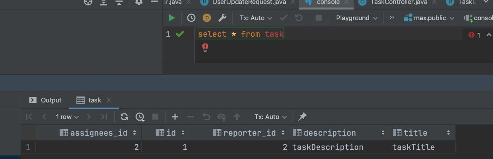

## PUT - Task

#### Запит

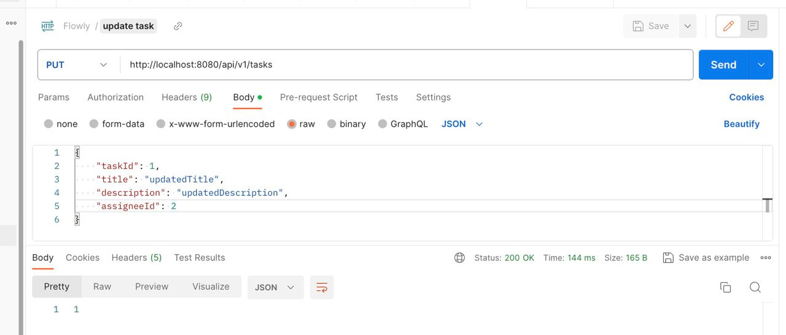

#### Результат

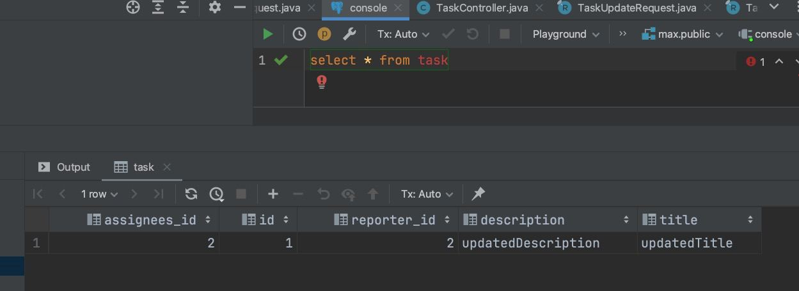

## DELETE - Task

#### Запит

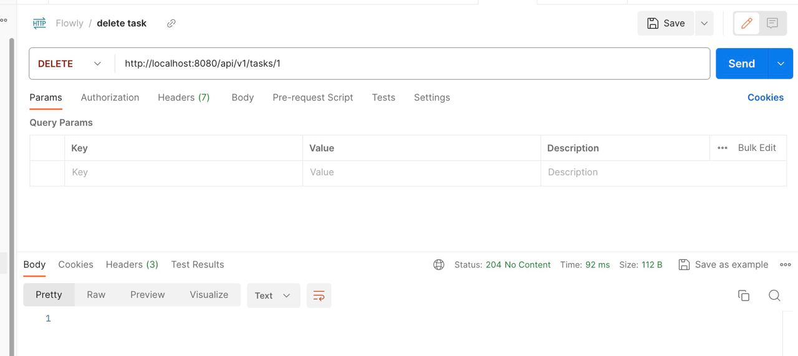

#### Результат

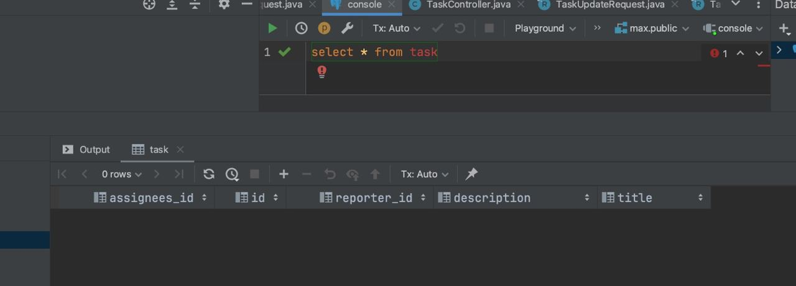